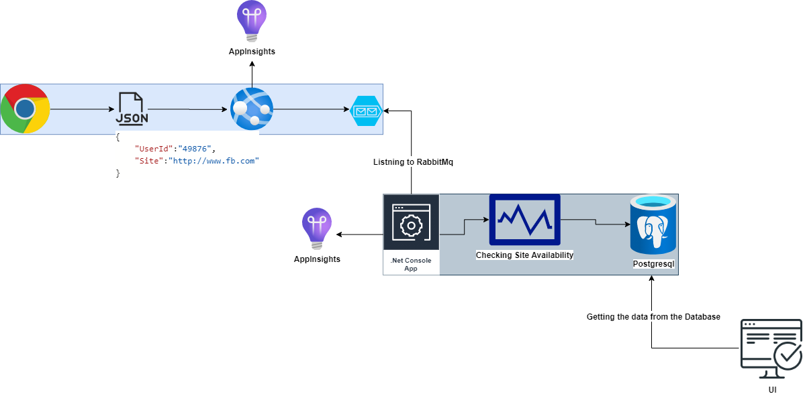

# SiteAvailabilityApi

# Architecture Diagram

SiteAvailabilityApi

# TechStack : 
.Net Core 3.1 We API
# Services Used : 
RabbitMq Message Queue, PostgreSql.
# Features : 
There are two Web API is implemented in this Project.

1. To Post the Messages to the RabbitMq.
2. To Get Site History by User 

# Deployement
This API is deployed as AppService in Azure.

# Docker Support

Docker File
Docker Compose File

# Telemetry

AppInsights

